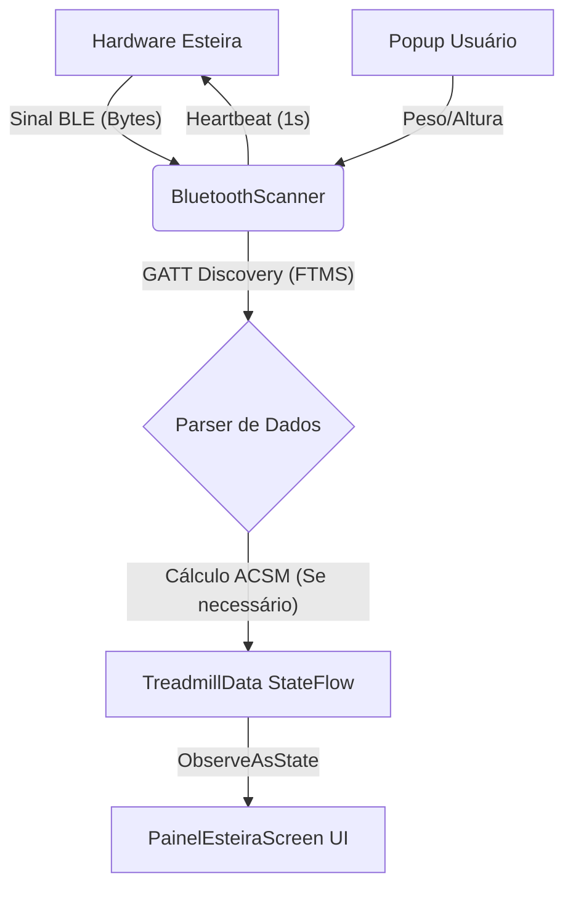

# 📘 Guia de Arquitetura e Desenvolvimento: TreadConnect

Este documento descreve a arquitetura técnica e o fluxo de funcionamento do sistema de integração Bluetooth entre o Android e a esteira **Zyou 250s**.

---

## 🏗️ 1. Diagrama de Arquitetura (Fluxo de Dados)

O fluxo abaixo demonstra como uma informação sai do hardware da esteira e chega até o visor do seu celular:



---

## 🛠️ 2. Especificações Técnicas (O Padrão FTMS)

A esteira utiliza o serviço padrão **FTMS (Fitness Machine Service)**. Isso significa que ela segue uma regra mundial de como organizar os dados de treino.

### Tabela de Endereços (UUIDs)
| Nome | UUID | Função |
| :--- | :--- | :--- |
| **Serviço FTMS** | `00001826...` | Porta principal de entrada para fitness. |
| **Treadmill Data** | `00002acd...` | Onde a esteira "notifica" velocidade e tempo. |
| **Escrita (Write)** | `0000fff2...` | Porta para enviarmos o Heartbeat (Batimento). |

---

## 🧩 3. Explicação Detalhada dos Métodos (Com Exemplos)

Abaixo estão os pilares do código, explicados para que qualquer desenvolvedor (mesmo júnior) entenda o porquê de cada linha.

### A. O Scanner (A Busca)
**O que faz:** Liga o rádio do celular para ouvir quem está por perto.
**Explicação Simples:** É como um radar que anota o nome de todo mundo que encontrar.
```kotlin
fun startScan() {
    _foundDevices.value = emptyList() // Limpa a lista antiga
    bluetoothLeScanner?.startScan(scanCallback) // Liga o radar
}
```

### B. A Conexão (Apertando a Mão)
**O que faz:** Cria o túnel de conversa privado e **para o scanner**.
**Por que parar o Scan?** Se você tentar conectar enquanto o radar está ligado, a conexão fica instável e "cai".
```kotlin
fun connectToDevice(device: BluetoothDevice) {
    bluetoothLeScanner?.stopScan(scanCallback) // Limpa o ruído
    bluetoothGatt = device.connectGatt(context, false, gattCallback, TRANSPORT_LE)
}
```

### C. O Heartbeat (Sinal de Vida)
**O que faz:** Envia um comando de 1 em 1 segundo.
**Por que?** A esteira é como um guarda: se você parar de falar por 1 segundo, ele fecha a porta por segurança.
```kotlin
private fun startHeartbeat() {
    heartbeatJob = scope.launch {
        while (isConnected) {
            sendByteToTreadmill(HEARTBEAT_BYTE)
            delay(1000) // Espera 1 segundo e manda de novo
        }
    }
}
```

### D. O Tradutor (Parser FTMS)
**O que faz:** Transforma números como `2C 01` em `3.0 km/h`.
```kotlin
// Exemplo de tradução de velocidade (Bytes para Decimal)
val speedRaw = ((data[3].toInt() and 0xFF) shl 8) or (data[2].toInt() and 0xFF)
val speed = speedRaw / 100.0 // Divide por 100 conforme regra FTMS
```

---

## 🔥 4. O Cálculo de Calorias (Ciência no App)

Como a esteira Zyou **não envia** as calorias via Bluetooth, o app usa a fórmula da **ACSM (American College of Sports Medicine)**.

### A Fórmula:
$$Calorias = \frac{MET \times \text{Peso} \times \text{Tempo}}{60}$$

**Onde o MET é calculado assim:**
```kotlin
// VO2 = (0.1 * vel) + (1.8 * vel * inclinação) + 3.5
val vo2 = (0.1 * speedMetersMin) + (1.8 * speedMetersMin * inclineDecimal) + 3.5
val met = vo2 / 3.5
```
**Por que o Popup de Peso?** 
Para uma criança, correr gasta pouca energia. Para um adulto pesado, gasta muita. Sem o peso digitado no popup, o app não saberia a diferença e o cálculo estaria errado.

---

## 🚦 5. Guia de Erros Comuns (Troubleshooting)

1.  **Status preso em "Conectando":** A esteira provavelmente está conectada a outro celular próximo. Desligue o Bluetooth dos outros aparelhos.
2.  **Números não mudam (Tudo 0.0):** Verifique se o `onDescriptorWrite` retornou sucesso. Se não, a "torneira" de dados não foi aberta.
3.  **App fechando sozinho:** Verifique se todas as permissões (Scan, Connect e Localização) foram aceitas no início.

---
*Este manual garante que a inteligência da integração com a esteira Zyou 250s seja preservada para futuras versões do TreadConnect.*
